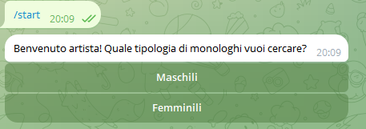
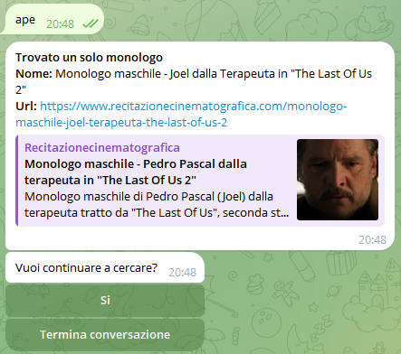

## Recitazione Cinematografica - RC BOT
_Unofficial_

---

Il progetto contiene un bot di telegram che permette all'utente di ricercare i contenuti
presenti sul blog italiano di [Recitazione Cinematografica](www.recitazionecinematografica.it).
Il blog è parte è parte di una community di recitazione con *1000+* membri e *2500+* articoli.

Il blog contiene vari contenuti, pricipalmente:
- Monologhi, divisi in _maschili_ e _femminili_
- Dialoghi
- Approfondimenti

---

## Come funziona

Il bot è raggiungibile pubblicamente su Telegram cercando il nickname
`@RecitazioneCinematografica_bot`.

### Ricerca dei monologhi

L'interazione inizia con il comando `/start`. Il bot risponde con un menu con 
le funzioni proposte. All'attuale versione `v1.0` è possibile solo cercare 
monologhi.

Successivamente basta inserire una o più parole chiave per la ricerca del monologo.
La ricerca avviene confrontando le parole inserite rispetto ai contenuti dei post
del blog. 

>**NOTA: non è possibile cercare per contenuto del monologo, ossia cercare in base
al testo del monologo ma solo in base al titolo e/o descrizione del post**

Nell'esempio si mostra come la keyword _ape_ produca un risultato in quanto
presente nella stringa _Ter**ape**uta_. In base agli articoli.
Viene restituito il collegamento alla pagina del blog con il monologo in 
questione.

>**NOTA: se si cerca usando più parole, ogni parola è considerata singolarmente.
> Se si cercasse _"tizo caio"_ si ottengono i monologhi che presentano almeno una 
> della due parole nel titolo.**

>**NOTA 2: meglio usare chiavi di ricerca significative. Esempio**
> - __Evitare parole e lettere troppo corte__: _a, b, c, ab_ ...
> - __Evitare parole ripetute__: _aaa, abbb, ccc_ ...
> - __Meglio testo significativo__: _rose rosse_, _garrone_, _sorrentino_, _robot_ ...

Al termine dell'interazione si può scegliere se continuare a cercare o se uscire.
Uscire significa che per cercare nuovi monologhi bisogna ripetere il comando `/start`. 

---

### Gestione utenti

Nella `v1.0` il bot è in fase di test per alcuni utenti.
Sarà possibile gestione di _blacklist_, _inviti_, _espulsioni_ etc.
In generale si vuole evitare che il bot sia disponibile per gli utenti
fuori dalla community.

### Aggiornamenti automatici

Per garantire che i contenuti aggiornati del blog siano visibili dal bot, è previsto
un update notturno che aggiorna la base dati del bot con i nuovi post del blog.

###

RC bot è un progetto **Open Source** ed è possibile, sotto altri nomi e domini, registrare
il proprio bot ad uso personale. Il progetto è **senza scopo di lucro**.

>***DISCLAMER: Tutti i contenuti di in termini di monologhi/dialoghi forniti all'utente dal bot sono di proprietà di RC - Recitazione cinematografica 
e dei suoi rispettivi proprietari.***

### Dati raccolti
Non vengono raccolti dati utente in quanto ogni interazione con il bot è _personale_, non si tratta
di una _chat di gruppo_. Possono essere raccolti i _nickname_ degli utenti per la gestione delle autorizzazioni ad utilizzare
il bot stesso ma è un dato pubblico e non sensibile.

_**Nota bene**: il nickname di Telegram è un dato pubblico non riconducibile alla persona fisica. Non è un dato sensibile.
L'utilizzo del bot è sicuro e si avvale solo di dati pubblici. Su Telegram divesi dati sono
pubblici e dichiarati non sensibili, ad esempio: foto profilo, nickname e username.
Più informazioni [qui](https://telegram.org/privacy/eu#3-1-basic-account-data)._

I nickname ci permettono di limitare l'utilizzo a:
- Utenti spammer, saranno espulsi. 
- Persone non più in community
- Altri bot spammer, saranno espulsi
---

### Funzionalità
- [x] Ricerca monologhi nel blog
- [x] Aggiornamento automatico con nuovi monologhi 
- [ ] Ricerca dialoghi
- [ ] Aggiornamento automatico con nuovi dialoghi
- [ ] Gestione utenti con funzionalità di gestione